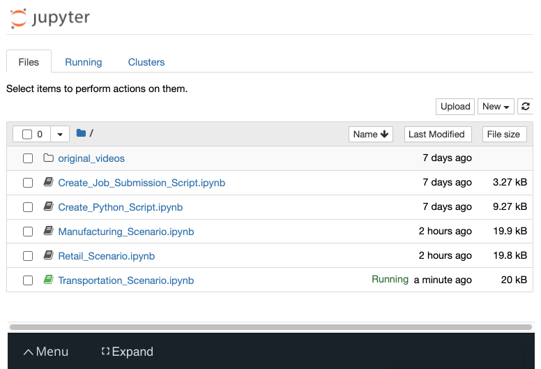

# Surveillance-Smart-Queuing-System

| Details            |              |
|-----------------------|---------------|
| Programming Language: |  Python 3.5 or 3.6 |

## What it Does

In this project, you will be given a real-world scenario of building a
queuing system for three different clients in three different industry
sectors. The sectors will consist of retail, manufacturing, and
transportation. Each client will have their own set of constraints and
requirements. You’ll use your knowledge of hardware specifications
to identify which hardware types might work, and then you’ll test
the application using the Intel® DevCloud for the Edge to see which
hardware performs best. Finally, after reviewing your test results
and considering the constraints and requirements of the client, you
will propose a hardware solution and justify your selection.

## How it Works

The goal of the project will be to reduce congestion in the queues.
To accomplish this goal, you’ll use Intel’s OpenVINO API and the person
detection model from the Open Model Zoo to count the number of people 
in each queue, so that people can be directed to the least congested queue. 
The counter will use the Inference Engine included in the Intel® Distribution of 
OpenVINO™ Toolkit.The model used should be able to identify people in a video frame.
The app should count the number of people in the current frame, the duration that a 
person is in the frame and the total count of people. 

Propose your best informed guess about which hardware might be best suited for that scenario and explain why you chose that hardware.
You will build out the application and test its perform on the DevCloud.
You’ll test your application not only in the hardware that you proposed, but on multiple hardware type, then compare the performance results
Test the performance. Revisal your proposed hardware based on the test results
The Scenarios are Manufacturing (factory site), Retail (grocery store), Transportation (train site).

## Requirements

### Hardware
*   Propose your best informed guess about which hardware might be best suited for that scenario and explain why you chose that hardware
*   You’ll test your application not only in the hardware that you proposed, but on multiple hardware type, then compare the performance results

### Software

*   Intel® Distribution of OpenVINO™ toolkit 2019 R3 release
*   Intel® DevCloud
        
## Setup

### Install Intel® Distribution of OpenVINO™ toolkit

Utilize the classroom workspace, or refer to the relevant instructions for your operating system for this step.

- [Linux/Ubuntu](./linux-setup.md)
- [Mac](./mac-setup.md)
- [Windows](./windows-setup.md)

### Scenario

*  Manufacturing
*  Retail Sector
*  Transportation

### Testing your Hardware

Over the next several pages, you'll find notebooks where you can build out the smart queuing application and test its performance on all four different hardware 
types (CPU, IGPU, VPU, and FPGA) using the DevCloud.

The next several pages each show a different Jupyter notebook for you to work on. Although these appear to be different workspaces, these notebooks—along with 
the files generated by your code—are all inside one shared workspace. If you click on the Jupyter icon in the upper left,you will be able to see all of the notebooks:

